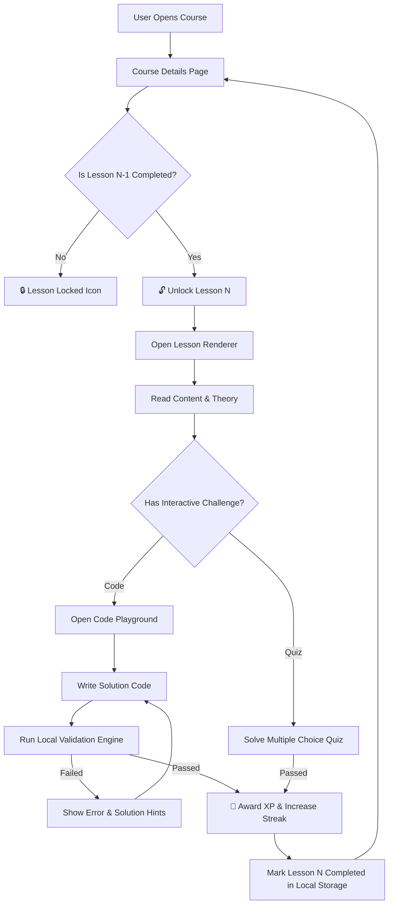

<div align="center">

# 🚀 Learnpg — Interactive Coding & E-Learning Platform

**Empowering the next generation of developers with structured interactive courses, real-time code execution, and gamified progress tracking.**

[](https://flutter.dev)
[](https://dart.dev)
[](https://flutter.dev)
[](LICENSE)
[](CONTRIBUTING.md)

---

[Key Features](#-key-features) •
[Interactive Curriculum](#-curriculum--courses) •
[Code Playground](#-in-app-code-playground) •
[Architecture](#-architecture--design-patterns) •
[Getting Started](#-getting-started) •
[Project Structure](#-project-structure)

</div>

---

## 🌟 Overview

**Learnpg** is a state-of-the-art cross-platform mobile and desktop application crafted with **Flutter & Dart**. Designed to turn complex computer science concepts into bite-sized, hands-on learning experiences, **Learnpg** combines **structured sequential curricula**, an **embedded code editor**, **real-time code validation**, and **gamified progression metrics** (XP points, streak tracking, level unlocking).

Whether you are mastering web fundamentals with HTML/CSS/JS, diving deep into low-level memory management with C and C++, constructing relational schemas with MySQL, or writing modern object-oriented code in Python & C#, **Learnpg** provides an uninterrupted, immersive environment to write, debug, and validate code right inside your app.

---

## ✨ Key Features

### 🔀 1. Sequential Lesson Unlocking System
* **Guided Progression**: Lessons are strictly sequential ($Lesson_{N}$ unlocks only after completing $Lesson_{N-1}$).
* **Completion Locks**: Prevents skip-ahead learning, ensuring learners grasp foundational concepts before advancing to advanced topics.
* **Persistent Progress**: Saved automatically locally and synced with user status metrics.

### 💻 2. Multi-Language Interactive Code Playground
* **Embedded Code Editor**: Custom dark-themed IDE with syntax line numbers, code snippets, auto-indentation, and control controls.
* **Real-time HTML/CSS/JS Preview**: Live web output rendered inside an isolated WebViewController for dynamic frontend visualization.
* **Code Validation Engine**: Built-in AST-like regex evaluation engine that checks output formatting, syntax structure, and challenge assertions.
* **Multi-Language Support**: Dedicated execution modes for `HTML`, `CSS`, `JavaScript`, `Python`, `SQL (MySQL)`, `C#`, `C++`, and `C`.

### 🎮 3. Gamification & XP System
* **XP & Level Progression**: Earn XP points for every passed quiz, code snippet submission, and completed lesson.
* **Daily Streaks**: Encourages continuous daily learning habits with streak counters and milestone rewards.
* **Badges & Achievement Badges**: Unlock achievements for completing entire modules or maintaining streaks.

### 📊 4. Interactive Quizzes & Assessments
* **Multiple Choice & True/False**: In-lesson interactive checks for knowledge retention.
* **Instant Feedback**: Real-time error analysis explaining *why* an answer is right or wrong.
* **Challenge Code Tasks**: Practical hands-on coding tests with targeted solution hints.

### 🎨 5. Modern UI & Glassmorphism Aesthetics
* **Dynamic Dark Theme**: Tailored dark mode color palette (Slate Navy, Electric Violet, Cyber Cyan) reducing visual fatigue.
* **Glassmorphic Navigation**: Custom floating bottom menu with smooth micro-animations.
* **Responsive Layouts**: Seamless transition across phone, tablet, and desktop viewports.

---

## 📚 Curriculum & Courses

Learnpg comes out of the box with **6 Comprehensive Tracks**, featuring over **310 Normalized Lessons** and **60 Modules**:

| Course | Category | Modules | Lessons | Key Concepts Covered |
| :--- | :---: | :---: | :---: | :--- |
| **🌐 HTML, CSS & JavaScript** | Web Development | 10 Modules | 50 Lessons | DOM manipulation, Flexbox/Grid, ES6+ Async/Await, Responsive Design |
| **🐍 Python for Beginners** | Scripting & Data | 10 Modules | 50 Lessons | Syntax, OOP, Data Structures, File I/O, Generators, Decorators |
| **🐬 MySQL Database Mastery** | Data Science | 10 Modules | 50 Lessons | Relational Schema Design, SQL Joins, Indexing, Transactions, Subqueries |
| **⚡ C# Fundamentals** | Enterprise & Games | 10 Modules | 50 Lessons | LINQ, Async Tasks, Interfaces, .NET Core, Object-Oriented Patterns |
| **🚀 C++ Programming** | Systems & Performance | 10 Modules | 55 Lessons | Pointers & References, STL Containers, Memory Allocation, Templates |
| **⚙️ The C Programming Language** | System Engineering | 10 Modules | 55 Lessons | Dynamic Memory (`malloc`/`free`), Bitwise Operations, Structs, Pointers |

---

## 🛠 Tech Stack

| Domain | Technology | Description |
| :--- | :--- | :--- |
| **Framework** | [Flutter](https://flutter.dev) `v3.x` | Multi-platform UI engine for mobile, web, desktop |
| **Language** | [Dart](https://dart.dev) `v3.x` | Strongly typed, sound null-safe programming language |
| **State Management** | State-driven Architecture | Reactive Flutter state management for responsive UI updates |
| **Validation Engine** | Custom Validation Service | Regex & structural code assertion service for interactive validation |
| **Local Storage** | Shared Preferences / JSON | Fast local persistence for offline progress, streaks & settings |
| **UI Components** | Custom Glassmorphic Suite | Custom dynamic components, animated cards, and floating nav bar |

---

## 🏗 Architecture & Design Patterns

Learnpg follows a clean, modular **Feature-First Architecture** designed for scalable maintenance and testability:

```
lib/
├── core/                       # App-wide global utilities
│   ├── constants/              # Colors, Typography, App Configuration
│   ├── theme/                  # Dark/Light Material 3 Theme definitions
│   └── utils/                  # Helper utilities & extensions
├── data/                       # Data Layer
│   ├── models/                 # Data schemas (Lesson, Module, Course, Quiz, Challenge)
│   └── repositories/           # Local Data Handlers & JSON parsers
├── services/                   # Business Logic & Core Engines
│   ├── validation_service.dart # Intelligent code solution checking engine
│   └── audio_service.dart      # Sound effects & haptic feedback controller
└── features/                   # Application Features (Vertical Slices)
    ├── auth/                   # Authentication & Onboarding
    ├── courses/                # Course details, curriculum outline & sequential locking
    ├── learning/               # Interactive Lesson Viewer, Markdown rendering & Quizzes
    ├── playground/             # Multi-language code editor & live preview execution
    ├── profile/                # User stats, streak counter, XP breakdown & achievements
    └── settings/               # App configuration & preferences
```

---

## 🚦 Sequential Unlocking & Code Validation Flow



---

## ⚡ Getting Started

Follow these steps to set up and run **Learnpg** on your local environment.

### 📋 Prerequisites

Make sure you have the following installed on your developer machine:
- [Flutter SDK](https://docs.flutter.dev/get-started/install) (`>= 3.0.0`)
- [Dart SDK](https://dart.dev/get-started/sdk) (`>= 3.0.0`)
- [Android Studio](https://developer.android.com/studio) or [VS Code](https://code.visualstudio.com/) with Flutter plugins.

### 📥 1. Clone the Repository

```bash
git clone https://github.com/Rafaaa4/learning-app.git
cd learning-app
```

### 📦 2. Install Dependencies

```bash
flutter pub get
```

### 🧪 3. Run Pre-flight Checks & Analysis

```bash
flutter analyze
```

### 🚀 4. Launch the App

```bash
# Run on an active emulator or connected device
flutter run

# To run specifically on Linux Desktop:
flutter run -d linux

# To run on Chrome (Web):
flutter run -d chrome
```

---

## 💻 In-App Code Playground

The **Learnpg Playground** gives developers an environment to practice without leaving the app:

* **HTML/CSS Visualizer**: Renders interactive web interfaces directly with live JS evaluation.
* **Script Evaluator**: Evaluates logic statements for Python, C++, C, C#, and MySQL query syntax.
* **Quick Templates**: Starter boilerplates for all supported languages so users can start coding instantly.

---

## 📝 License

Distributed under the **MIT License**. See `LICENSE` for more information.

---

<div align="center">
  <sub>Built with ❤️ using <strong>Flutter & Dart</strong>. Created by <a href="https://github.com/Rafaaa4">Rafaaa4</a>.</sub>
</div>
